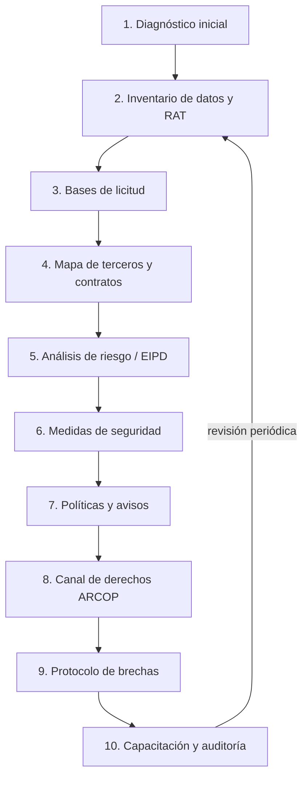
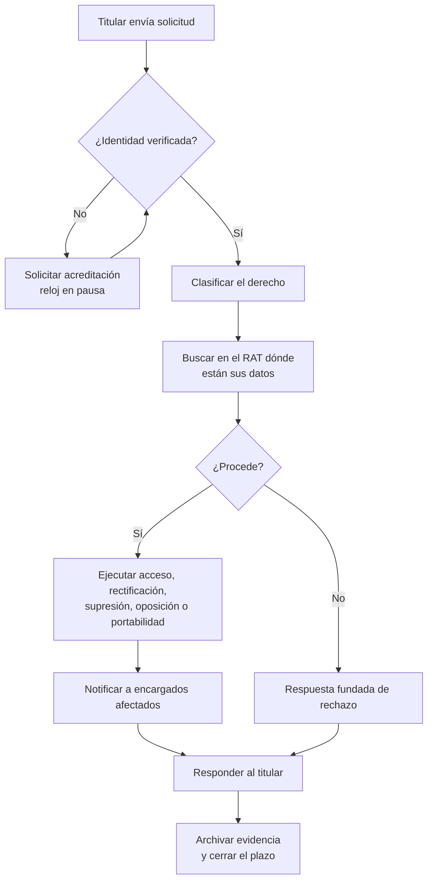
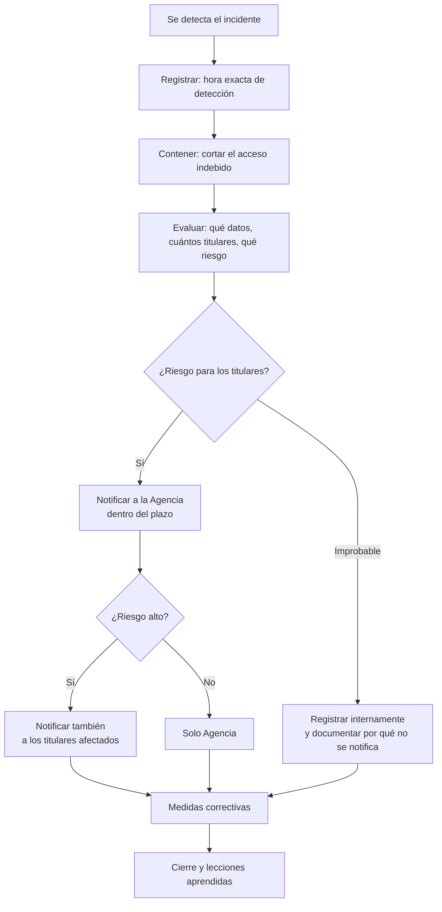

# Protocolo de manejo de información — Guía de dominio y especificación de producto

Documento base para construir un **software web que permita a una empresa
implementar y mantener su protocolo de manejo de datos personales** conforme
a la Ley N° 21.719 (Chile), sea cual sea su rubro.

Contiene tres cosas distintas, marcadas como tales:

| Marca | Qué es |
|---|---|
| 📘 **NORMA** | Obligación que impone la ley. Debe verificarse contra el texto oficial |
| 🔧 **PRODUCTO** | Propuesta de diseño del software. Es criterio, no obligación |
| ⚠️ **VERIFICAR** | Dato que puede haber cambiado por reglamento posterior |

> ⚠️ **Advertencia de alcance.** Este documento es una guía técnica para
> construir software, **no asesoría legal**. Los plazos, montos y umbrales
> deben validarse contra el texto vigente de la Ley 21.719, sus reglamentos
> y los criterios que dicte la Agencia de Protección de Datos Personales,
> con un abogado especialista, antes de que el software los presente a un
> cliente como obligación.

---

# Parte 1 — Marco normativo

## 1.1 Por qué existe demanda ahora

📘 **NORMA.** La Ley 21.719 reemplaza el régimen de la Ley 19.628, crea la
**Agencia de Protección de Datos Personales** con potestad fiscalizadora y
sancionatoria, y establece un período de adecuación antes de su plena
vigencia.

⚠️ **VERIFICAR:** fecha exacta de entrada en vigencia y si hubo prórrogas.
La referencia habitual es **1 de diciembre de 2026** (24 meses desde su
publicación en diciembre de 2024).

Esto define la oportunidad comercial: **toda empresa que trate datos
personales debe adecuarse, y la mayoría no sabe por dónde partir.** Ese
"no saber por dónde partir" es exactamente lo que el software resuelve.

## 1.2 Roles (define todo el modelo de datos)

| Rol | Qué es | Ejemplo |
|---|---|---|
| **Titular** | La persona natural dueña de los datos | Un cliente, un trabajador, un paciente |
| **Responsable** | Quien decide **para qué** y **cómo** se tratan | La empresa que contrata el software |
| **Encargado** | Quien trata datos **por cuenta** del responsable | Proveedor de nube, ERP, plataforma de RRHH |
| **Delegado (DPO)** | Quien supervisa el cumplimiento dentro de la organización | Cargo interno o externo |
| **Agencia** | Autoridad fiscalizadora y sancionadora | Agencia de Protección de Datos Personales |

🔧 **PRODUCTO.** Una misma empresa suele ser **responsable** de unos
tratamientos y **encargada** de otros. El software debe permitir ambos roles
en la misma cuenta; asumir uno solo es el error de diseño más común.

## 1.3 Principios

📘 **NORMA.** Todo tratamiento debe respetar:

1. **Licitud y lealtad** — debe existir una base legal que lo habilite.
2. **Finalidad** — declarada, específica y previa a la recolección.
3. **Proporcionalidad / minimización** — solo los datos necesarios.
4. **Calidad** — exactos, completos y actualizados.
5. **Responsabilidad (accountability)** — no basta cumplir: hay que **poder
   demostrarlo**.
6. **Seguridad** — medidas apropiadas al riesgo.
7. **Transparencia e información** — el titular debe saber qué pasa con sus datos.
8. **Confidencialidad** — deber de reserva, incluso después de terminada la relación.

🔧 **PRODUCTO.** El principio 5 es la clave del negocio: **el valor del
software es producir la evidencia**. Registros, fechas, versiones,
responsables, trazas. Sin evidencia, cumplir no sirve de nada ante una
fiscalización.

## 1.4 Bases de licitud

📘 **NORMA.** Un tratamiento necesita al menos una:

| Base | Cuándo aplica | Riesgo típico |
|---|---|---|
| **Consentimiento** | Libre, informado, específico, inequívoco y **revocable** | Se abusa de ella; se usa donde no corresponde |
| **Ejecución de contrato** | Necesario para prestar lo contratado | Se estira para justificar marketing |
| **Obligación legal** | Lo exige otra ley (tributaria, laboral, sanitaria) | Debe citarse la norma concreta |
| **Interés legítimo** | Del responsable o un tercero, ponderado con los derechos del titular | Exige ponderación documentada |
| **Interés vital** | Vida o integridad física | Casos excepcionales |
| **Función pública** | Ejercicio de potestades públicas | Solo organismos públicos |

🔧 **PRODUCTO.** El software debe **obligar a elegir una base por cada
actividad** y, si se elige interés legítimo, exigir el test de ponderación
escrito. Este es el punto donde más empresas fallan.

## 1.5 Categorías especiales

📘 **NORMA.** Régimen reforzado para:

- **Datos sensibles**: salud, biométricos, origen racial o étnico, afiliación
  política, sindical o religiosa, vida sexual y orientación sexual.
- **Datos de niños, niñas y adolescentes**.
- **Datos de infracciones penales** — régimen restringido; prohibido su
  tratamiento masivo fuera de finalidades legítimas.
- **Datos económicos, financieros y de obligaciones patrimoniales** — Chile
  mantiene un título especial con reglas propias (plazos de comunicación,
  caducidad de la información de morosidad).

🔧 **PRODUCTO.** Marcar una actividad como "sensible" debe **disparar
automáticamente**: evaluación de impacto, medidas de seguridad reforzadas y
revisión de la base de licitud.

## 1.6 Derechos de los titulares

📘 **NORMA.** Conocidos como **ARCOP**:

| Derecho | Qué puede exigir el titular |
|---|---|
| **A**cceso | Saber qué datos suyos existen, su origen y finalidad |
| **R**ectificación | Corregir datos inexactos o incompletos |
| **C**ancelación / supresión | Que se eliminen sus datos |
| **O**posición | Que cese un tratamiento determinado |
| **P**ortabilidad | Recibir sus datos en formato estructurado y transferible |
| *Bloqueo* | Suspensión temporal del tratamiento |
| *Decisiones automatizadas* | No quedar sujeto solo a decisiones automatizadas con efectos jurídicos, y pedir intervención humana |

⚠️ **VERIFICAR:** plazo de respuesta. La referencia habitual es **30 días
corridos**, prorrogable en casos justificados. Confirmar contra texto vigente.

🔧 **PRODUCTO.** Este es **el módulo que más se usa a diario** y el mejor
gancho comercial: un canal de solicitudes con reloj, alertas de vencimiento
y respuesta trazable.

## 1.7 Brechas de seguridad

📘 **NORMA.** Ante un incidente que afecte datos personales, el responsable
debe **notificar a la Agencia sin dilaciones indebidas** y, cuando el riesgo
para los titulares sea alto, **notificar también a los afectados**. Debe
llevarse **registro de todos los incidentes**, incluso los no notificables.

⚠️ **VERIFICAR:** el plazo concreto. La referencia de mercado es **72 horas**
desde que se toma conocimiento; el encargado debe avisar al responsable
antes (24 horas es la práctica contractual habitual) para que este alcance a
notificar.

🔧 **PRODUCTO.** El cronómetro es la funcionalidad estrella: al registrar un
incidente, arranca la cuenta regresiva y el sistema guía la evaluación de
notificabilidad.

## 1.8 Registro de actividades de tratamiento (RAT)

📘 **NORMA.** Responsables y encargados deben mantener un registro de sus
actividades de tratamiento, disponible para la Agencia.

🔧 **PRODUCTO.** **El RAT es el corazón del software.** Todo lo demás
—políticas, contratos, evaluaciones, respuestas a titulares— se deriva de
él. Si el RAT está bien construido, el resto se puede generar solo.

## 1.9 Transferencias internacionales

📘 **NORMA.** Permitidas hacia países con nivel adecuado de protección, o con
garantías apropiadas (cláusulas contractuales, normas corporativas
vinculantes), o con consentimiento informado del titular.

🔧 **PRODUCTO.** Casi toda pyme chilena transfiere sin saberlo: usa Google
Workspace, Microsoft 365, AWS, Meta, Mailchimp. **Detectar esto genera un
"¡ah!" inmediato en la demo comercial.**

## 1.10 Sanciones

📘 **NORMA.** Régimen de infracciones leves, graves y gravísimas, con multas
en UTM y posibilidad de suspender operaciones de tratamiento en casos
graves.

⚠️ **VERIFICAR:** montos. Las cifras de referencia son hasta **5.000 UTM**
para graves y **20.000 UTM** para gravísimas.

📘 **NORMA.** Existe un **modelo de prevención de infracciones** que, si está
debidamente implementado y certificado, opera como atenuante o eximente.

🔧 **PRODUCTO.** **Este es el argumento de venta más fuerte:** el software no
es un gasto de cumplimiento, es la evidencia que reduce la multa. Vender
"seguro" convierte mejor que vender "orden".

---

# Parte 2 — El protocolo: 10 etapas

🔧 **PRODUCTO.** Este es el flujo que el software debe guiar. Cada etapa es
una pantalla, produce un artefacto y alimenta la siguiente.



## Etapa 1 — Diagnóstico inicial

**Objetivo:** saber dónde está parada la empresa y calcular su nivel de riesgo.

**Entradas:** rubro, tamaño, N° de trabajadores, si trata datos sensibles, si
tiene web/app, si usa proveedores extranjeros, si hace marketing, si
comparte datos con terceros.

**Salida:** informe de brechas de cumplimiento + nivel de riesgo + plan de
trabajo priorizado.

🔧 Que sea un **cuestionario de 15-25 preguntas cerradas**, respondible en 10
minutos por alguien sin conocimiento legal. Es el gancho de captación: se
regala el diagnóstico, se cobra la implementación.

## Etapa 2 — Inventario de datos y RAT

**Objetivo:** saber qué datos hay, dónde, de quién y para qué.

Por cada actividad de tratamiento se registra:

- Nombre y descripción de la actividad
- Área responsable
- Finalidad
- Categorías de datos y si hay sensibles
- Categorías de titulares
- Origen de los datos
- Sistemas donde viven
- Destinatarios internos y externos
- Transferencias internacionales
- Plazo de conservación
- Medidas de seguridad aplicadas
- Base de licitud

🔧 **Precargar plantillas por rubro** (Parte 3). Una pyme no puede inventar su
RAT desde cero; sí puede confirmar y ajustar uno preexistente. **Aquí está
la diferencia entre un producto que se usa y uno que se abandona.**

## Etapa 3 — Bases de licitud

Asignar base a cada actividad. Si es consentimiento → definir cómo se obtiene
y cómo se revoca. Si es interés legítimo → test de ponderación documentado.

**Salida:** matriz de licitud + alertas de actividades sin base válida.

## Etapa 4 — Mapa de terceros y contratos

Inventario de proveedores que acceden a datos, con: qué datos, para qué,
dónde están alojados, si hay contrato de encargo (DPA) firmado.

**Salida:** listado de subencargados + contratos faltantes + generación
automática del anexo de tratamiento de datos.

## Etapa 5 — Análisis de riesgo y evaluación de impacto (EIPD)

📘 **NORMA.** Exigible cuando el tratamiento entraña alto riesgo (datos
sensibles a gran escala, observación sistemática, decisiones automatizadas,
datos de NNA, biometría).

🔧 Que el sistema **determine solo** si corresponde EIPD según los atributos
ya cargados en el RAT, en vez de preguntárselo al usuario.

## Etapa 6 — Medidas de seguridad

Catálogo de controles, con estado (implementado / parcial / pendiente) y
responsable:

**Técnicas:** control de acceso por roles, cifrado en tránsito y en reposo,
respaldos y prueba de restauración, registro de accesos (logs), doble factor,
seudonimización, gestión de vulnerabilidades, borrado seguro.

**Organizativas:** políticas internas, cláusulas de confidencialidad en
contratos laborales, capacitación, control de accesos físicos, política de
escritorio limpio, procedimiento de altas y bajas de personal.

🔧 Asociar cada medida al **riesgo que mitiga**, para justificar
proporcionalidad ante una fiscalización.

## Etapa 7 — Políticas y avisos

Documentos que el software debe **generar automáticamente** desde el RAT:

- Política de privacidad (externa, para el sitio web)
- Política interna de tratamiento de datos
- Avisos de recolección para formularios y contratos
- Cláusula de datos para contratos laborales
- Política de cookies y consentimiento web
- Procedimiento de ejercicio de derechos
- Protocolo de brechas
- Política de conservación y eliminación

## Etapa 8 — Canal de derechos ARCOP

Formulario público + bandeja interna con: registro, verificación de
identidad, clasificación del derecho, reloj de plazo, alertas, respuesta
formal y archivo de evidencia.

## Etapa 9 — Protocolo de brechas

Registro del incidente → evaluación de riesgo → decisión de notificar →
notificación a la Agencia y/o titulares → medidas correctivas → cierre y
lecciones. Todo con fechas y responsables.

## Etapa 10 — Capacitación y auditoría

Registro de capacitaciones (quién, cuándo, contenido, evidencia),
auditorías internas periódicas y revisión anual del RAT.

---

# Parte 3 — Variaciones por rubro

🔧 **PRODUCTO.** Cada rubro se precarga como plantilla: actividades típicas,
datos que trata, riesgos y controles obligatorios.

| Rubro | Datos críticos | Riesgo principal | Detonante especial |
|---|---|---|---|
| **Salud / clínicas** | Ficha clínica, diagnósticos, exámenes | Datos sensibles a gran escala | EIPD casi siempre obligatoria |
| **Educación** | Datos de NNA, notas, conducta, fotos | Menores de edad | Consentimiento de padres/tutores |
| **Retail / e-commerce** | Compras, navegación, perfilamiento | Marketing sin base válida | Cookies y consentimiento web |
| **Financiero / cobranza** | Deudas, morosidad, scoring | Título especial de datos económicos | Plazos de caducidad de la morosidad |
| **RRHH / servicios transitorios** | Postulantes, contratos, salud laboral, huella | Biometría de asistencia | Base de licitud de la biometría |
| **Inmobiliario** | Antecedentes comerciales de arrendatarios | Uso de informes comerciales | Consentimiento y finalidad acotada |
| **Transporte / logística** | Geolocalización de conductores, cámaras | Vigilancia laboral | Proporcionalidad y aviso previo |
| **Legal** | Causas, contrapartes, infracciones penales | Datos penales | Régimen restringido, sin exportación masiva |
| **Tecnología / SaaS** | Datos de clientes de sus clientes | Actúa como **encargado** | DPA con cada cliente + subencargados |
| **Turismo / hotelería** | Pasaportes, alergias alimentarias | Datos de extranjeros y salud | Transferencias internacionales |
| **Seguros** | Salud, siniestros, scoring | Sensibles + decisiones automatizadas | Derecho a intervención humana |

**Actividades comunes a casi toda empresa** (base del RAT por defecto):
gestión de personal, remuneraciones, postulaciones, clientes y facturación,
proveedores, marketing y comunicaciones, videovigilancia, control de
accesos, atención de reclamos, y sitio web con cookies.

---

# Parte 4 — Especificación del software

## 4.1 Módulos

| # | Módulo | Función |
|---|---|---|
| 1 | **Diagnóstico** | Cuestionario y nivel de riesgo inicial |
| 2 | **RAT** | Inventario de actividades de tratamiento |
| 3 | **Licitud** | Bases legales y tests de ponderación |
| 4 | **Terceros** | Proveedores, DPA, transferencias internacionales |
| 5 | **Riesgos / EIPD** | Evaluaciones de impacto |
| 6 | **Seguridad** | Catálogo de controles y su estado |
| 7 | **Documentos** | Generación de políticas y avisos |
| 8 | **Derechos** | Bandeja de solicitudes ARCOP con plazos |
| 9 | **Incidentes** | Registro y gestión de brechas |
| 10 | **Formación** | Capacitaciones y evidencia |
| 11 | **Panel** | Semáforo de cumplimiento y pendientes |
| 12 | **Evidencia** | Expediente exportable para fiscalización |

## 4.2 Modelo de datos

```
Organizacion
  id, razon_social, rut, rubro, tamano, direccion, web
  rol_predominante (responsable | encargado | ambos)
  dpo_nombre, dpo_email, dpo_designado_en

Usuario
  id, organizacion_id, nombre, email, rol (admin | dpo | area | lectura)

Area
  id, organizacion_id, nombre, responsable_usuario_id

ActividadTratamiento          ← el RAT; entidad central
  id, organizacion_id, area_id
  nombre, descripcion, finalidad
  rol_organizacion (responsable | encargado)
  base_licitud, base_licitud_detalle
  tiene_datos_sensibles, tiene_datos_nna, tiene_datos_penales
  tiene_decisiones_automatizadas, es_gran_escala
  origen_datos, plazo_conservacion, criterio_eliminacion
  requiere_eipd (derivado), estado, version, actualizado_en

CategoriaDato
  id, actividad_id, nombre, tipo (identificacion | contacto | salud |
  biometrico | economico | penal | ubicacion | navegacion | otro)
  es_sensible

CategoriaTitular
  id, actividad_id, nombre (trabajadores | clientes | postulantes |
  pacientes | menores | proveedores | visitantes)

Sistema
  id, organizacion_id, nombre, tipo (propio | saas | fisico), ubicacion_datos

Tercero                        ← encargados y destinatarios
  id, organizacion_id, nombre, pais, tipo (encargado | responsable |
  subencargado), servicio
  hay_transferencia_internacional, garantia_transferencia
  dpa_firmado, dpa_fecha, dpa_documento_id

TestPonderacion               ← solo si base = interés legítimo
  id, actividad_id, interes_perseguido, necesidad, impacto_titular,
  salvaguardas, conclusion, evaluado_por, fecha

EvaluacionImpacto             ← EIPD
  id, actividad_id, motivo, descripcion_riesgos, nivel_riesgo,
  medidas_mitigacion, riesgo_residual, requiere_consulta_agencia,
  aprobada_por, fecha

MedidaSeguridad
  id, organizacion_id, tipo (tecnica | organizativa), nombre, descripcion,
  estado (implementada | parcial | pendiente), responsable_usuario_id,
  fecha_objetivo, evidencia_documento_id

SolicitudTitular              ← ARCOP
  id, organizacion_id, tipo (acceso | rectificacion | supresion |
  oposicion | portabilidad | bloqueo | revision_humana)
  titular_nombre, titular_contacto, identidad_verificada
  recibida_en, vence_en (derivado), estado, respuesta, respondida_en,
  respondida_por, documento_respuesta_id

Incidente                     ← brechas
  id, organizacion_id, detectado_en, descripcion, origen
  datos_afectados, titulares_afectados_aprox, nivel_riesgo
  notificable_agencia, notificada_agencia_en
  notificable_titulares, notificados_titulares_en
  medidas_contencion, medidas_correctivas, cerrado_en

Capacitacion
  id, organizacion_id, titulo, fecha, contenido, evidencia_documento_id

AsistenciaCapacitacion
  id, capacitacion_id, usuario_id, asistio

Documento                     ← todo lo generado o subido
  id, organizacion_id, tipo, nombre, version, generado_en, archivo_url

RegistroAuditoria             ← quién hizo qué (accountability)
  id, organizacion_id, usuario_id, accion, entidad, entidad_id,
  detalle, fecha
```

🔧 **Nota de diseño.** `ActividadTratamiento` es el nodo del que cuelga todo.
Un cambio ahí debe **invalidar los documentos generados** y marcarlos para
regeneración; si no, el cliente termina con una política que ya no describe
lo que hace.

## 4.3 Reglas de negocio automatizables

Aquí está el valor real del producto: convertir criterio legal en lógica.

```
SI actividad.tiene_datos_sensibles Y actividad.es_gran_escala
   ENTONCES requiere_eipd = true

SI actividad.tiene_datos_nna
   ENTONCES requiere_eipd = true Y exigir consentimiento de tutor

SI actividad.tiene_decisiones_automatizadas
   ENTONCES requiere_eipd = true Y exigir mecanismo de revisión humana

SI actividad.base_licitud = 'interes_legitimo' Y NO existe TestPonderacion
   ENTONCES alerta CRÍTICA "base de licitud sin respaldo"

SI actividad.base_licitud = 'consentimiento' Y NO existe mecanismo de revocación
   ENTONCES alerta ALTA

SI tercero.hay_transferencia_internacional Y tercero.garantia_transferencia
   ES NULA ENTONCES alerta CRÍTICA

SI tercero.tipo = 'encargado' Y NO tercero.dpa_firmado
   ENTONCES alerta CRÍTICA "encargado sin contrato de tratamiento"

SI actividad.plazo_conservacion ES NULO
   ENTONCES alerta MEDIA "sin política de conservación"

SI actividad.tiene_datos_penales
   ENTONCES bloquear exportación masiva Y exigir medidas reforzadas

SolicitudTitular.vence_en = recibida_en + PLAZO_RESPUESTA
   alerta al 50% del plazo, al 80% y al vencer

Incidente: al crear, iniciar cronómetro de notificación
   alerta a las 24h y a las 48h desde detectado_en
```

⚠️ `PLAZO_RESPUESTA` y el plazo de notificación deben ser **parámetros de
configuración**, nunca constantes en el código: van a cambiar con los
reglamentos.

## 4.4 Panel de cumplimiento

🔧 Un porcentaje único desmotiva o falsea. Mejor **semáforo por dimensión**:

| Dimensión | Se mide con |
|---|---|
| Inventario | % de áreas con RAT completo |
| Licitud | % de actividades con base válida y respaldada |
| Terceros | % de encargados con DPA firmado |
| Seguridad | % de medidas implementadas |
| Documentación | Políticas vigentes y no desactualizadas |
| Derechos | Solicitudes respondidas dentro de plazo |
| Incidentes | Incidentes cerrados y notificados a tiempo |
| Formación | % de personal capacitado en los últimos 12 meses |

## 4.5 Flujo de una solicitud ARCOP



## 4.6 Flujo de un incidente



---

# Parte 5 — Cómo construirlo

## MVP (lo mínimo que ya se puede vender)

1. Diagnóstico inicial con informe de brechas — **capta clientes**
2. RAT con plantillas por rubro — **el núcleo**
3. Bases de licitud con alertas
4. Generación de política de privacidad y avisos
5. Canal de derechos ARCOP con reloj
6. Panel de semáforos

## Versión 2

7. Terceros y generación de DPA
8. EIPD guiada
9. Gestión de incidentes con cronómetro
10. Catálogo de medidas de seguridad
11. Expediente de evidencia exportable

## Versión 3

12. Capacitaciones con seguimiento
13. Multi-empresa (para consultoras y estudios que atienden cartera)
14. Recordatorios de revisión anual
15. Asistente de IA que redacta finalidades y tests de ponderación

🔧 **Decisión de arquitectura:** multi-tenant estricto desde el primer día
(`organizacion_id` en toda tabla y en toda consulta). Un software de
protección de datos que filtra datos entre clientes no tiene segunda
oportunidad comercial.

🔧 **Y lo evidente que conviene decir en voz alta:** este software trata
datos personales, así que **debe cumplir consigo mismo**. Su propio RAT, su
propia política, su propio DPA con los clientes. En la demo, mostrar eso
vende más que cualquier funcionalidad.

---

# Parte 6 — Límites y advertencias

1. **Verificar todo plazo y monto** contra el texto vigente y los reglamentos
   de la Agencia antes de mostrarlos como obligación al cliente.
2. **El software no sustituye asesoría legal.** Conviene declararlo en el
   contrato y en la interfaz: es una herramienta de gestión y evidencia.
3. **No prometer "cumplimiento garantizado"** ni "certificación". Quien
   certifica es la autoridad, no el proveedor. Prometer eso es exponerse.
4. **Las plantillas por rubro son un punto de partida**, no un dictamen: el
   usuario debe confirmarlas y ajustarlas.
5. **Sumar un abogado especialista al equipo** para validar las plantillas y
   las reglas de negocio. Es el activo que un competidor no copia rápido.
